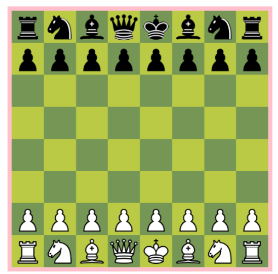

# Scress-II
Damals habe ich mit 2-3 Mitstudenten an einem Schulprojekt gearbeitet, in welchem wir ein kleines Schach entwickeln wollten. Grundlage dafür war Java, Springboot, Vaadin und MongoDB. Dieses Projekt trug den Namen SCRESS.
Einige Zeit später wollte ich zum Projekt zurückgehen und den Code verbessern. Mir wurde jedoch relativ schnell klar, dass vieles geändert werden musste. Nach einigen Stunden refactoring und Bugfixing habe ich mich schlussendlich dafür entschieden, das ganze Projekt nochmals neu aufzusetzen. Diesmal in der Frontend Variante mit Vue.JS und Typescript. 

Das ganze Projekt ist relativ simpel. Ein anschauliches Schachbrett im 2-Spieler Modus, mit den normalen Schachregeln.


## Project Start
Bevor das Projekt gestartet werden kann, müssen mit ```npm install``` alle Dependencies installiert werden.
Um daraufhin das Projekt zu starten, muss nur ```npm run dev``` ausgeführt werden.

### Type-Check, Compile and Minify for Production

```sh
npm run build
```
